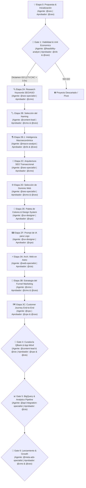

# 🚀 Funnel de Desarrollo de Negocio & Ciclo de Vida de Startup (Business Development Lifecycle)

**Documento Maestro de Arquitectura de Operaciones**  
**Startup Builder Framework**  
**Aprobado por:** Christian (Founder & Director Supremo) & `@ceo`  
**Última Actualización:** 2026-09-12  

---

## 📌 Visión General

El **Funnel de Desarrollo de Negocio (Business Development Lifecycle)** es la metodología estricta, secuencial y basada en datos mediante la cual **Startup Builder** transforma una idea inicial en una empresa digital en producción.

Cada sub-etapa exige la **persistencia en markdown de un entregable específico** en la carpeta `projects/[startup-id]/funnel/` o `website/` antes de que el siguiente agente pueda proceder. El tablero Kanban (`projects/[active_project_id]/kanban-board.md`) administra estas dependencias mediante **Compuertas de Control (Stage Gates)** bloqueantes.

### 🛡️ Protocolo de Gobernanza, Auditoría y Visto Bueno C-Level (Kanban 4-States)
Toda tarea avanza secuencialmente a través de 4 estados en `projects/[active_project_id]/kanban-board.md`:  
`Por Hacer` ➔ `En Progreso` ➔ `En Revisión` ➔ `Completado (Done)`

Entre cada transición de sub-etapa, se ejecuta de forma obligatoria el **Protocolo de Gobernanza & Visto Bueno C-Level**:
1. **PROMPT 1 (Auditoría Kanban por `@project-admin`):** El Administrador del Proyecto (`@project-admin`) audita que el entregable físico se haya creado en markdown, que el archivo esté en `projects/[startup-id]/`, que las notas estén actualizadas y que el estado en el Kanban sea **`En Revisión`**.
2. **PROMPT 2 (Revisión & Visto Bueno por el Líder C-Level Responsable):** El Líder Ejecutivo C-Level del dominio correspondiente (`@ceo`, `@cmo`, `@cpo`, `@cto`, `@cfo`) evalúa la calidad estratégica/técnica del entregable.
   - *Si aprueba:* Mueve la tarea a **`Completado (Done)`**, desbloquea la siguiente etapa en el Kanban y autoriza la ejecución del siguiente agente.
   - *Si rechaza o pide mejoras:* Devuelve la tarea a **`En Progreso`** agregando feedback correctivo específico para el agente operativo.
3. **PROMPT 3 (Siguiente Agente Operativo):** Prompt listo para ejecutar la siguiente tarea desbloqueada (tras recibir el visto bueno C-Level).

## 🗺️ Mapa Completo del Embudo de Desarrollo de Negocio & Aprobadores C-Level

---

## 📋 Detalle Paso a Paso de la Cadena Secuencial de Persistencia & Aprobaciones

### 💡 Etapa 0: Propuesta de Idea & Inicialización del Proyecto
- **Agente Operativo:** `@founder` ➔ `@ceo`
- **Aprobador C-Level:** `@ceo`
- **Acción:** Creación de estructura `projects/[startup-id]/`, activación en `agents/active-project.md` e inicialización del Kanban.
- **Archivo Persistido:** `projects/[startup-id]/kanban-board.md` y `agents/ceo/notes.md`.

---

### 📊 Etapa 1: Evaluación Cuantitativa de Viabilidad & Unit Economics (GATE 1)
- **Agente Operativo:** `@feasibility-analyst`
- **Aprobador C-Level:** `@cfo` & `@ceo`
- **Acción:** Modelar LTV:CAC, payback, margen neto y matriz de riesgos.
- **Archivo Persistido:** `projects/[startup-id]/feasibility-study.md`.

---

### 🔍 Etapa 2A: Investigación de Keywords & Clúster SEO/ASO (GATE 2A)
- **Agente Operativo:** `@seo-specialist`
- **Aprobador C-Level:** `@cmo`
- **Acción:** Analizar volumen de búsqueda, intención comercial y dificultad de palabras clave en Google Search y Google Play Store.
- **Archivo Persistido:** `projects/[startup-id]/funnel/seo-keywords-research.md`.

---

### 🏷️ Etapa 2B: Selección & Persistencia del Naming Comercial (GATE 2B)
- **Agente Operativo:** `@content-lead`
- **Aprobador C-Level:** `@cmo` & `@ceo`
- **Acción:** Seleccionar el nombre comercial oficial optimizado para SEO y ASO basado en la investigación de la Etapa 2A.
- **Archivo Persistido:** `projects/[startup-id]/funnel/brand-and-naming.md`.

---

### 🌎 Etapa 2B.1: Inteligencia Macroeconómica & Entorno de Industria (GATE 2B.1)
- **Agente Operativo:** `@macro-analyst`
- **Aprobador C-Level:** `@cfo` & `@ceo`
- **Acción:** Analizar tendencias PESTEL, regulaciones de homologación/visas, poder adquisitivo por región (PPP) y contexto de mercado global para respaldar precios y posicionamiento.
- **Archivo Persistido:** `projects/[startup-id]/macro-analysis.md`.

---

### 📐 Etapa 2C: Arquitectura SEO Transaccional de la Web (GATE 2C)
- **Agente Operativo:** `@seo-specialist`
- **Aprobador C-Level:** `@cmo`
- **Acción:** Definir la estructura jerárquica de URLs, sitemap transaccional (Landings de Nicho, Calculadoras, Glosarios) e intencionalidad de conversión.
- **Archivo Persistido:** `projects/[startup-id]/funnel/seo-transactional-architecture.md`.

---

### 🌐 Etapa 2D: Selección & Persistencia del Dominio Web (GATE 2D)
- **Agente Operativo:** `@seo-specialist`
- **Aprobador C-Level:** `@cmo` & `@ceo`
- **Acción:** Seleccionar el dominio oficial `.com` / `.app` priorizando autoridad SEO, facilidad de recordación y disponibilidad.
- **Archivo Persistido:** `projects/[startup-id]/funnel/domain-strategy.md`.

---

### 🎨 Etapa 2E: Paleta de Colores & Sistema de Diseño (GATE 2E)
- **Agente Operativo:** `@ux-designer`
- **Aprobador C-Level:** `@cpo`
- **Acción:** Definir la paleta de colores HSL/Hexadecimal, psicología cromática, tipografías y tokens de interfaz UI.
- **Archivo Persistido:** `projects/[startup-id]/funnel/design-system-and-branding.md`.

---

### 🖼️ Etapa 2F: Prompt para Generación del Logo con IA (GATE 2F)
- **Agente Operativo:** `@ux-designer`
- **Aprobador C-Level:** `@cpo`
- **Acción:** Redactar el prompt ultra-específico e ingeniería de instrucciones para generar el logo vectorial/SVG e icono de app mediante herramientas de IA.
- **Archivo Persistido:** `projects/[startup-id]/funnel/logo-ai-prompt.md`.

---

### ⚡ Etapa 3A: Instrucciones & Especificación Técnica Web en Astro (GATE 3A)
- **Agente Operativo:** `@web-specialist`
- **Aprobador C-Level:** `@cto`
- **Acción:** Documentar la arquitectura técnica, componentes UI, páginas y optimizaciones de rendimiento (< 1.5s) para el desarrollo en Astro.
- **Archivo Persistido:** `projects/[startup-id]/website/astro-architecture-spec.md`.

---

### 🎯 Etapa 3B: Estrategia del Funnel de Marketing (GATE 3B)
- **Agente Operativo:** `@cmo`
- **Aprobador C-Level:** `@cmo` & `@ceo`
- **Acción:** Diseñar el embudo comercial completo (TOFU atracción, MOFU consideración, BOFU oferta/conversion y secuencias de nurturing).
- **Archivo Persistido:** `projects/[startup-id]/funnel/marketing-funnel.md`.

---

### 🗺️ Etapa 3C: Mapeo del Customer Journey End-to-End (GATE 3C)
- **Agente Operativo:** `@cpo`
- **Aprobador C-Level:** `@cpo` & `@ceo`
- **Acción:** Diseñar la experiencia completa del usuario desde el primer toque publicitario, onboarding in-app, uso del QBank NGN hasta la renovación de suscripción.
- **Archivo Persistido:** `projects/[startup-id]/funnel/customer-journey-end-to-end.md`.

---

### 📱 Etapa 4: Curaduría de Contenidos QBank & Desarrollo de App Móvil (GATE 4)
- **Agentes Operativos:** `@content-lead`, `@ux-designer` & `@cto`
- **Aprobador C-Level:** `@cpo` & `@cto`
- **Acción:** Curar preguntas NGN bilingües y programar la aplicación webapp/móvil.
- **Directorio de Entrega:** `projects/[startup-id]/webapp/`.

---

### 📊 Etapa 5: Infraestructura BigQuery & Analytics Pipeline (GATE 5)
- **Agente Operativo:** `@api-integration-specialist`
- **Aprobador C-Level:** `@cto` & `@cfo`
- **Acción:** Crear esquemas de base de datos e ingesta de eventos de conversión temporal.
- **Archivo Persistido:** `projects/[startup-id]/database/schema-and-dictionary.md`.

---

### 🚀 Etapa 6: Lanzamiento, Ads & Crecimiento (GATE 6)
- **Agentes Operativos:** `@meta-ads-specialist`, `@growth-hacker` & `@customer-success`
- **Aprobador C-Level:** `@cmo` & `@ceo`
- **Acción:** Activar pauta digital, optimizar tasa de conversión in-app y escalar el MRR.

