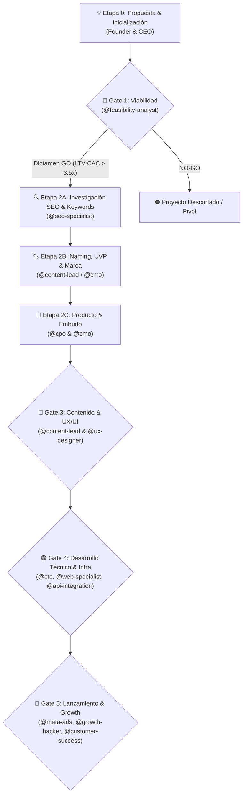

# 🚀 Funnel de Desarrollo de Negocio & Ciclo de Vida de Startup (Business Development Lifecycle)

**Documento Maestro de Arquitectura de Operaciones**  
**Startup Builder Framework**  
**Aprobado por:** Christian (Founder & Director Supremo) & `@ceo`  
**Fecha de Publicación:** 2026-09-12  

---

## 📌 Visión General

El **Funnel de Desarrollo de Negocio (Business Development Lifecycle)** es la metodología estricta, secuencial y basada en datos mediante la cual **Startup Builder** transforma una idea inicial en una empresa digital rentable en producción.

Cada etapa cuenta con **Compuertas de Control (Stage Gates)** bloqueantes: ninguna etapa puede iniciarse si la compuerta previa no ha sido entregada, validada por datos y aprobada formalmente en el tablero Kanban (`projects/[active_project_id]/kanban-board.md`) por el CEO (`@ceo`).

---

## 🗺️ Mapa Completo del Embudo de Desarrollo de Negocio

---

## 📋 Detalle Paso a Paso de la Cadena de Producción

### 💡 Etapa 0: Propuesta de Idea & Inicialización del Proyecto
- **Responsable:** Christian (Founder) ➔ `@ceo`
- **Acción:** Christian propone la idea o nicho. El CEO realiza la evaluación estratégica inicial, crea la carpeta en `projects/[startup-id]/` (`website/`, `webapp/`, `funnel/`, `database/`, `kanban-board.md`), activa el proyecto en `agents/active-project.md` y registra la primera directiva en `agents/ceo/notes.md`.
- **Entregables:** 
  - Estructura de directorio `projects/[startup-id]/` creada.
  - `agents/active-project.md` actualizado.
  - `projects/[startup-id]/kanban-board.md` inicializado con tareas bloqueantes.

---

### 📊 Etapa 1: Evaluación Cuantitativa de Viabilidad & Unit Economics (GATE 1)
- **Responsable:** `@feasibility-analyst` (supervisado por `@ceo` y `@cfo`)
- **Acción:** Investigar volúmenes de búsqueda por API, modelar precios, LTV, CAC objetivo, margen neto, payback y matriz de riesgos.
- **Criterio de Aprobación del Gate:** LTV:CAC Neto > 3.5x, Payback < 60 días, Margen Neto > 75%.
- **Entregables:** 
  - Documento oficial `projects/[startup-id]/feasibility-study.md`.
  - Dictamen formal (GO / NO-GO / VIABLE CON CONDICIONES) en `agents/feasibility-analyst/notes.md`.
  - Cambio de estado en Kanban: `[TASK-01]` a `Completado` y aprobación del CEO.

---

### 🔍 Etapa 2A: Investigación SEO & Selección de Keywords Maestras (GATE 2A)
- **Responsable:** `@seo-specialist` (supervisado por `@cmo`)
- **Acción:** Investigar el universo de términos de búsqueda en Google Search y Google Play / App Store (volumen, intencionalidad informacional vs. comercial, competencia y dificultad).
- **Entregables:** 
  - Documento `projects/[startup-id]/seo-and-naming-strategy.md`.
  - Clúster maestro de Keywords clasificadas por volumen e intención.
  - Actualización en `agents/seo-specialist/notes.md`.

---

### 🏷️ Etapa 2B: Naming Comercial, Branding & Propuesta Única de Valor (GATE 2B)
- **Responsable:** `@content-lead` & `@cmo`
- **Acción:** Tomar el clúster de Keywords de la Etapa 2A para crear la arquitectura de Naming comercial (optimizado para SEO/ASO), la Propuesta Única de Valor (UVP), el tagline publicitario y las guías de tono de marca.
- **Entregables:** 
  - Documento `projects/[startup-id]/funnel/brand-and-naming.md`.
  - Nombre oficial seleccionado, disponibilidad de dominio y nombre de app en tiendas.

---

### 🎯 Etapa 2C: Arquitectura de Producto & Embudo Comercial (GATE 2C)
- **Responsable:** `@cpo` (Experiencia de Usuario) & `@cmo` (Embudo de Ventas)
- **Acción:** Definir las especificaciones de producto (QBank, simulador adaptativo CAT, onboarding) y el diseño del embudo comercial (TOFU-MOFU-BOFU, secuencias de email nurturing, oferta y estrategia de precios).
- **Entregables:** 
  - `projects/[startup-id]/funnel/customer-journey-end-to-end.md`
  - `projects/[startup-id]/funnel/marketing-funnel.md`

---

### 🎨 Etapa 3: Curaduría de Contenidos & Diseño UX/UI (GATE 3)
- **Responsable:** `@content-lead` (Bancos de contenido/preguntas) & `@ux-designer` (Diseño Visual)
- **Acción:** Redactar y curar los bancos de preguntas/contenidos clínicos bilingües. Diseñar los wireframes interactivos, interfaz gráfica (UI), tokens de diseño y componentes de la app móvil y landing page.
- **Entregables:** 
  - Archivos JSON / datos de contenido base.
  - Wireframes y diseño UI en `projects/[startup-id]/webapp/` y `website/`.

---

### 💻 Etapa 4: Desarrollo Técnico & Infraestructura (GATE 4)
- **Responsable:** `@cto`, `@web-specialist` (Landing Page Astro), `@api-integration-specialist` (BigQuery)
- **Acción:** Inicializar y programar la aplicación móvil/web en `/webapp/`, construir la landing comercial de alta conversión en `/website/` y desplegar el esquema de base de datos e ingesta de eventos en BigQuery en `/database/`.
- **Entregables:** 
  - Aplicación funcional en `projects/[startup-id]/webapp/`.
  - Landing page optimizada en `projects/[startup-id]/website/`.
  - Diccionario y esquema de base de datos en `projects/[startup-id]/database/schema-and-dictionary.md`.

---

### 🚀 Etapa 5: Lanzamiento, Adquisición & Retención (GATE 5)
- **Responsable:** `@meta-ads-specialist`, `@growth-hacker`, `@customer-success`
- **Acción:** Lanzar campañas de pauta (Meta/Google Ads), activar bucles virales de recomendación e implementar monitoreo continuo de métricas in-app (DAU/MAU, Churn, NPS).
- **Entregables:** 
  - Campañas activas de captación con ROAS positivo.
  - Dashboard de conversión y retención en BigQuery.

---

## 📌 Protocolo de Gobernanza & Pase de Estafeta (Hand-off)

1. **Consulta Obligatoria de `agents/active-project.md`:** Todo agente debe consultar este archivo al iniciar cualquier ciclo.
2. **Revisión de Archivos de Contexto Obligatoria:** Cada prompt generado debe instruir al agente receptor a leer:
   - Sus instrucciones (`agents/[role]/instructions.md`).
   - Su prompt de sistema (`agents/[role]/prompt.md`).
   - Sus notas de rol (`agents/[role]/notes.md`).
   - Las notas del agente asignador (`agents/[assigning-role]/notes.md`).
   - El archivo `projects/[startup-id]/kanban-board.md`.
3. **Bloque de Salida Obligatorio:** Todo agente debe cerrar su intervención entregando a Christian el bloque Markdown listo para copiar y pegar titulado `👉 PRÓXIMO PROMPT SUGERIDO PARA EL SIGUIENTE AGENTE`.
