# 🏛️ Estructura Orgánica y Jerarquía por Canales (Startup Builder)

En esta estructura, el equipo se organiza desde el nivel ejecutivo (C-Level) hasta **especialistas dedicados por cada canal de adquisición, plataforma y producto**.

---

## 📊 Organigrama General por Canales y Especialidades

```mermaid
graph TD
    %% Dirección Suprema
    Christian["🚀 Christian<br/>Founder & Director Supremo"]

    %% Nivel Ejecutivo
    CEO["👑 CEO<br/>Chief Executive Officer (Agente IA)"]
    
    Christian --> CEO

    CMO["📢 CMO<br/>Chief Marketing Officer"]
    CPO["🎨 CPO<br/>Chief Product Officer"]
    CTO["⚙️ CTO<br/>Chief Technology Officer"]
    
    CEO --> CMO
    CEO --> CPO
    CEO --> CTO

    %% Rama de Marketing & Canales (CMO)
    subgraph Canales_Marketing ["📢 Marketing & Canales de Adquisición (CMO)"]
        ContentLead["✍️ Content Lead<br/>(Estrategia Editorial & Copys)"]
        WebSpec["🌐 Web & CRO Specialist<br/>(Landing Page Astro & Conversión)"]
        MetaAds["📲 Meta Ads Specialist<br/>(Facebook Ads, Instagram & Reels)"]
        YoutubeSpec["🎬 YouTube Specialist<br/>(Contenido en Video & SEO YouTube)"]
        SEOSpec["🔍 SEO Specialist<br/>(Posicionamiento Orgánico en Google)"]
        MediaBuyer["🎯 Media Buyer<br/>(Tráfico Pago & Presupuestos)"]
    end
    
    CMO --> ContentLead
    CMO --> WebSpec
    CMO --> MetaAds
    CMO --> YoutubeSpec
    CMO --> SEOSpec
    CMO --> MediaBuyer

    %% Rama de Producto (CPO)
    subgraph Rama_Producto ["🎨 Producto & Experiencia de Usuario (CPO)"]
        UXUI["📐 UI/UX Designer<br/>(Diseño App React & Onboarding)"]
        CustomerSupport["💬 Customer Support Specialist<br/>(Soporte Omnicanal: Chat, Email)"]
        CustomerSuccess["💖 Customer Success Specialist<br/>(Optimización de Funnel & Retención)"]
    end
    
    CPO --> UXUI
    CPO --> CustomerSupport
    CPO --> CustomerSuccess

    %% Rama de Tecnología (CTO)
    subgraph Rama_Tecnologia ["⚙️ Tecnología & Desarrollo (CTO)"]
        FrontendDev["💻 Frontend Dev<br/>(React & Astro)"]
        BackendDev["⚡ Backend & AI Dev<br/>(Python, Gemini, BigQuery)"]
    end
    
    CTO --> FrontendDev
    CTO --> BackendDev
```

---

## 👤 Matriz de Roles por Canal

| Canal / Plataforma | Especialista a Cargo | Reporta a | Enfoque Principal |
| :--- | :--- | :--- | :--- |
| **Estrategia de Contenidos** | **Content Lead** (`content-lead/`) | CMO | Estrategia editorial, copys de landings, anuncios y guiones. |
| **Página Web / Landings** | **Web & CRO Specialist** (`web-specialist/`) | CMO | Vel. de carga, pruebas A/B, experiencia en sitio Astro (`/website`). |
| **Facebook & Instagram Ads** | **Meta Ads Specialist** (`meta-ads-specialist/`) | CMO / Media Buyer | Campañas de pago, Pixel/CAPI, creativos en Meta Business Suite. |
| **YouTube & Video** | **YouTube Specialist** (`youtube-specialist/`) | CMO | Videos largos, Shorts, miniaturas, SEO de YouTube y retención. |
| **Google & Búsqueda Orgánica** | **SEO Specialist** (`seo-specialist/`) | CMO | Posicionamiento orgánico en motores de búsqueda a costo $0. |
| **Publicidad Digital Pagada** | **Media Buyer** (`media-buyer/`) | CMO | Estrategia global de presupuestos de pago y atribución. |
| **Experiencia de Producto** | **UI/UX Designer** (`ux-designer/`) | CPO | Interfaz de la app en React (`/webapp`), onboarding y retención. |
| **Soporte & Atención** | **Customer Support Specialist** (`customer-support/`) | CPO | Atención omnicanal (chat, email, tickets) y resolución de dudas. |
| **Optimización de Funnel & LTV**| **Customer Success Specialist** (`customer-success/`) | CPO | Cuellos de botella post-compra, retención y reducción de Churn. |
