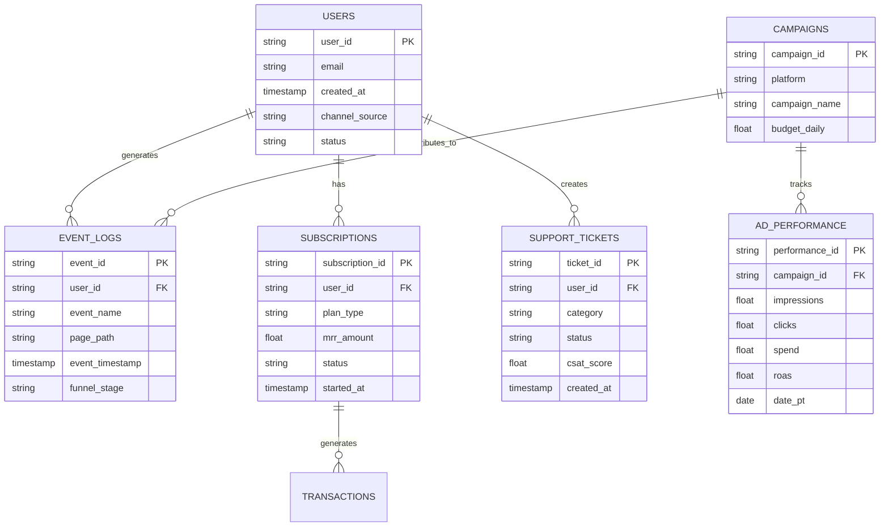

# 🗄️ Google Cloud BigQuery - Arquitectura de Datos & Diccionario de Tablas

Este documento es la **fuente oficial de verdad para la arquitectura de datos** en Google BigQuery para Startup Builder. Todo dato recopilado por el sitio web (`/website`), la aplicación (`/webapp`), las campañas de anuncios y el soporte debe almacenarse de forma estructurada siguiendo principios **100% Data-Driven**.

---

## 📐 1. Diagrama de Relaciones de Datos (Entity-Relationship)

---

## 📊 2. Diccionario de Datasets y Tablas en BigQuery

### Dataset: `analytics_raw` (Datos Crutos & Eventos)

#### Tabla: `event_logs`
* **Descripción:** Almacena cada interacción y evento del usuario en `/website` y `/webapp` (clics, registros, inicios de sesión).
* **Particionamiento:** `event_timestamp` (Diario).

| Campo / Feature | Tipo de Dato | Modo | Descripción |
| :--- | :--- | :--- | :--- |
| `event_id` | STRING | REQUIRED | Identificador único del evento (UUID). |
| `user_id` | STRING | NULLABLE | ID del usuario autenticado (si aplica). |
| `session_id` | STRING | REQUIRED | ID de sesión de navegación. |
| `event_name` | STRING | REQUIRED | Nombre del evento (ej: `landing_page_view`, `signup_click`). |
| `funnel_stage` | STRING | REQUIRED | Etapa del funnel (`TOFU`, `MOFU`, `BOFU`, `POST_BOFU`). |
| `page_path` | STRING | REQUIRED | Ruta de la página (ej: `/`, `/login`, `/dashboard`). |
| `utm_source` | STRING | NULLABLE | Fuente de adquisición (ej: `facebook`, `google`, `youtube`). |
| `utm_campaign` | STRING | NULLABLE | Nombre de la campaña publicitaria. |
| `event_timestamp` | TIMESTAMP | REQUIRED | Marca de tiempo exacta del evento en UTC. |

---

### Dataset: `marketing_performance` (Métricas de Pauta & Adquisición)

#### Tabla: `ad_performance`
* **Descripción:** Almacena métricas consolidadas de rendimiento por anuncio y campaña (Meta, Google, YouTube).

| Campo / Feature | Tipo de Dato | Modo | Descripción |
| :--- | :--- | :--- | :--- |
| `performance_id` | STRING | REQUIRED | ID único del registro diario de rendimiento. |
| `platform` | STRING | REQUIRED | Plataforma publicitaria (`meta`, `google`, `youtube`). |
| `campaign_id` | STRING | REQUIRED | ID de campaña en la plataforma. |
| `impressions` | INT64 | REQUIRED | Número total de impresiones. |
| `clicks` | INT64 | REQUIRED | Número total de clics en el anuncio. |
| `spend` | NUMERIC | REQUIRED | Gasto acumulado en USD. |
| `conversions` | INT64 | REQUIRED | Número de conversiones atribuida. |
| `roas` | NUMERIC | REQUIRED | Retorno de inversión publicitaria (`(Conversiones * LTV) / Spend`). |
| `date_pt` | DATE | REQUIRED | Fecha de reporte (Particionamiento principal). |

---

### Dataset: `customer_intelligence` (Clientes & Retención)

#### Tabla: `users`
* **Descripción:** Master data de usuarios de la plataforma `/webapp`.

| Campo / Feature | Tipo de Dato | Modo | Descripción |
| :--- | :--- | :--- | :--- |
| `user_id` | STRING | REQUIRED | Identificador único de usuario (Primary Key). |
| `email` | STRING | REQUIRED | Correo electrónico principal. |
| `status` | STRING | REQUIRED | Estado del usuario (`active`, `churned`, `trial`). |
| `created_at` | TIMESTAMP | REQUIRED | Fecha de registro. |
| `last_active_at` | TIMESTAMP | NULLABLE | Última actividad registrada. |

---

## 🛡️ 3. Reglas de Gobernanza y Buenas Prácticas en BigQuery

1. **Particionamiento y Clusterización:**
   - Todas las tablas de eventos y logs masivos deben particionarse por fecha (`DATE(event_timestamp)`) y clusterizarse por `user_id` y `event_name` para optimizar costos de consulta.
2. **Modelado Cero Subjetividad:**
   - Queda prohibido tomar decisiones basadas en intuiciones o impresiones sin consulta SQL a las tablas de BigQuery.
3. **Mantenimiento del Documento:**
   - El **CTO** y el **Backend Dev** deben actualizar este documento ante cualquier creación de nueva tabla, columna o relación de datos.
